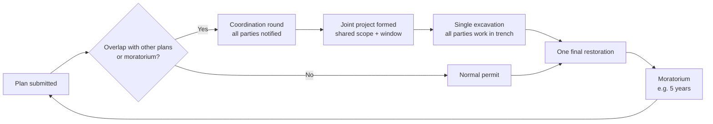

# PRD: Coordinated Street Excavation Management

Sep 26, 2026 · @Jussi Hermunen

## Helsinki context

The pilot city is Helsinki, and Helsinki already runs its own street-works system, Haitaton. This product should therefore extend Haitaton with dig-once coordination, not compete with it.

| System | Owner | What it does today | Role for this product |
| --- | --- | --- | --- |
| [Haitaton](https://haitaton.hel.fi) | City of Helsinki, Urban Environment | Projects (hanke) on a map, disruption index (haittaindeksi), utility location requests (johtoselvitys) and excavation notifications (kaivuilmoitus); kaivuilmoitus mandatory in Haitaton since 1 May 2025 ([customer guide](https://www.hel.fi/static/hkr/luvat/haitaton/haitaton-asiakasohje.pdf)) | Primary integration and likely host: coordination rounds, joint projects, moratoriums and resident subscriptions built as Haitaton modules or a service beside it |
| [Haitaton source code](https://github.com/City-of-Helsinki/haitaton-backend) | City of Helsinki | Open source under MIT; Kotlin, Spring Boot, PostgreSQL/PostGIS, Azure Blob Storage; [UI repo](https://github.com/City-of-Helsinki/haitaton-ui) | Sets the tech stack and licence model a vendor should follow so the city can take over operation |
| [Verkkotietopiste](https://www.traficom.fi/fi/viestinta/viestintaverkot/yhteisrakentaminen/verkkotietopiste) | Traficom (national) | Planned network construction and existing networks for telecom, electricity, district heating/cooling, gas, water and transport; has an electronic interface | Import other operators' planned works to detect overlaps early; export Helsinki plans back |
| [Johtotieto / Johtotietopankki](https://johtotietopankki.fi/tietoa-meista/) | Johtotieto Oy, state-owned, part of Erillisverkot group | National cable and pipe location service; hundreds of thousands of inquiries a year | Identify which asset owners have networks in a segment, so they are invited to the coordination round |
| Helsinki johtotietopalvelu | City of Helsinki (johtotietopalvelu@hel.fi) | City's own utility information service, referenced in the Haitaton guide | Same use as Johtotieto for city-owned networks |

The legal basis for coordinating underground work already exists. The Joint Construction Act ([Yhteisrakentamislaki 276/2016](https://traficom.fi/fi/ajankohtaista/yhteisrakentaminen-jaa-usein-vain-haaveeksi-yhteisrakentamislain-noudattaminen)) requires network operators to publish planned works in Verkkotietopiste in advance, but Traficom reported in October 2024 that too few operators do so; its first enforcement decision came in September 2024. The EU [Gigabit Infrastructure Act](https://digital-strategy.ec.europa.eu/en/policies/gigabit-infrastructure-act) (Regulation 2024/1309) has applied in full since 12 May 2026 and strengthens coordination of civil works.

Implication: the gap is not a missing permit system or a missing plans registry, but the step between them. Nothing today turns an overlap into a joint project, protects a restored street, or tells residents what is coming.

**Operating model.** A vendor builds and operates the service first, then hands it over to the city. That requires open source code owned by the city, the Haitaton stack, infrastructure as code on the city's cloud, and full documentation and runbooks as contract deliverables.

## Problem

The same city street is often dug up several times within a few years, because each party plans its underground work alone. A water utility renews a pipe, the street is resurfaced, and months later the telecom operator or district heating company opens it again.

Each extra excavation costs the city and its residents:

- **Traffic disruption** – lane closures, detours, slower public transport and blocked access for businesses and emergency services.
- **Shorter pavement life** – every trench and patch weakens the road structure and speeds up wear.
- **Wasted money** – temporary patching, repeated traffic arrangements and duplicate restoration are paid several times over.
- **Loss of trust** – residents see a freshly paved street torn up again and conclude that nobody coordinates.

The root cause is information, not engineering: parties do not see each other's plans early enough, and there is no shared process that turns one opening of the street into one combined job.

This product gives the city one place where all planned street works are visible, overlaps are detected automatically, every affected party is notified, and the works are executed as a single coordinated excavation – followed by a protection period during which the street is not opened again without a strong reason.

## Goals, non-goals and success metrics

The product succeeds when a street is opened once for all the work it needs, and then left alone.

**Goals**

1. Make every planned street excavation visible to all relevant parties at least 12 months ahead where possible.
2. Detect spatial and temporal overlaps between plans automatically.
3. Notify every party with assets or plans in the affected street segment, and give them a clear deadline to join.
4. Combine overlapping works into one coordinated project with one excavation window, one traffic arrangement and one final restoration.
5. Protect newly restored streets with a moratorium period, enforced in the permit process.
6. Give the city data on disruption, cost and compliance to improve the policy over time.

**Non-goals (for now)**

- Replacing Haitaton or its excavation notification (kaivuilmoitus) process – we extend and integrate with it.
- Detailed engineering design, cable routing or construction project management tools.
- Managing emergency repairs in real time – they are recorded and exempted, not planned.
- Resident-facing journey planning; we publish open data others can use (resident notifications for their own street are in scope).

**Success metrics**

| Metric | Baseline | Target (2 years after launch) |
| --- | --- | --- |
| Repeat excavations of the same segment within 3 years of resurfacing | To be measured in pilot | −50 % |
| Share of planned works entered ≥ 6 months ahead | To be measured | ≥ 80 % |
| Overlaps detected that end up as a joint project | – | ≥ 60 % |
| Total lane-closure days per year in pilot area | To be measured | −25 % |
| Moratorium breaches without an approved exception | – | 0 |
| Utilities and contractors actively using the system | – | All major asset owners in the city |

## Stakeholders and users

The city owns the process; utilities and contractors do most of the data entry; everyone else mainly reads.

| Role | Who | What they need from the system |
| --- | --- | --- |
| Street coordinator (primary admin) | City street / public works department | See all plans on a map, spot conflicts, form joint projects, grant or deny permits, enforce moratoriums |
| Asset owner planner | Water & sewer, district heating, electricity, gas, telecom and fibre operators, public lighting, traffic signals, tram/rail | Submit multi-year plans, get notified of opportunities to join, commit to a slot in a joint excavation |
| City infrastructure planner | City street maintenance, resurfacing programme, cycling and pedestrian projects | Align resurfacing and street redesign with underground works so paving is done last |
| Contractor / site manager | Construction companies executing the work | Know the combined scope, schedule of each party in the trench, and restoration requirements |
| Traffic management | City traffic planning, public transport authority, emergency services | See upcoming closures early, approve one combined traffic arrangement |
| Residents and businesses | People living and working on the street | Know when and why the street will be closed, and for how long |
| City leadership | Council, department heads | Reports on disruption, cost savings and compliance |
| Vendor (build and operate phase) | Software supplier selected by the city | Clear requirements, access to Haitaton and city cloud, a defined handover to the city's own operation |

## Core concept: dig once

Every street segment moves through one lifecycle: plans are collected, overlaps trigger a coordination round, the parties dig together, the street is restored once, and a moratorium protects it afterwards.

Key ideas:

- **Street segment as the unit.** All plans, assets and moratoriums attach to standardised street segments (e.g. block-to-block), so overlaps are unambiguous.
- **Coordination round.** When a plan touches a segment, every asset owner with network in that segment, and everyone with a plan nearby in time, is invited to join. They answer "join", "not needed" or "need more time" before a deadline.
- **Joint project.** Joiners share one excavation window, one traffic arrangement and one restoration. A lead party (usually the initiator) runs the site; costs are split by an agreed formula.
- **No mid-project patching.** Work sequence inside the joint project is planned so the trench stays open until the last party is done, with only temporary safe covering – not a new surface.
- **Moratorium.** After final restoration the segment is locked for a set period. Opening it requires an approved exception and usually a higher fee plus full-width restoration.
- **Silence has a cost.** A party that was invited, declined, and then wants to dig during the moratorium is the main case the policy penalises.

## Functional requirements

Must-haves cover the full dig-once loop for planned works; should- and could-haves improve adoption and insight.

| ID | Requirement | Priority |
| --- | --- | --- |
| FR-1 | Organisations and users with roles (coordinator, asset owner, contractor, viewer); SSO for city staff | Must |
| FR-2 | Street network split into segments, imported from the city's GIS | Must |
| FR-3 | Submit a planned work: location (draw on map or pick segments), type, asset owner, earliest/latest start, duration, depth/width, flexibility | Must |
| FR-4 | Bulk import of multi-year investment plans (CSV / GeoJSON / API) | Must |
| FR-5 | Map and timeline views of all plans, moratoriums and active sites, with filters by owner, status and time | Must |
| FR-6 | Automatic conflict detection: same or adjacent segment within a configurable time window, or inside a moratorium | Must |
| FR-7 | Coordination round: invite all asset owners in the segment plus owners of overlapping plans; response deadline; reminders | Must |
| FR-8 | Notifications by email and in-app for parties; subscription to areas or segments | Must |
| FR-9 | Joint project: members, lead party, shared window, work sequence per party, single restoration task | Must |
| FR-10 | Moratorium registry: set automatically on restoration completion; length by street class | Must |
| FR-11 | Exception workflow for works inside a moratorium, with justification, approval and fee flag | Must |
| FR-12 | Emergency work logging (after the fact) that does not reset or break moratorium rules | Must |
| FR-13 | Audit trail of all decisions, responses and changes | Must |
| FR-14 | Integration with Haitaton: a kaivuilmoitus cannot be approved without a cleared coordination check; hanke data flows both ways | Should |
| FR-15 | Cost-sharing calculator for joint projects (by trench length, width, number of parties) | Should |
| FR-16 | Combined traffic arrangement plan attached to a joint project, shared with traffic management | Should |
| FR-17 | Resident and business subscriptions: anyone can follow an address, street or area and get email/push notices when works are planned, confirmed, start and end (no login beyond email verification) | Must |
| FR-18 | Reports: excavations per segment, avoided re-digs, closure days, compliance | Should |
| FR-19 | Look up asset owners in a segment via Johtotieto and Helsinki johtotietopalvelu, to find who must be invited | Could |
| FR-20 | Suggestions: "your 2029 plan could join this 2027 project" based on flexibility windows | Could |
| FR-21 | Photo and as-built documentation upload at completion | Could |
| FR-22 | Public map and open data API of upcoming and active works | Should |
| FR-23 | Import planned network works in Helsinki from Traficom Verkkotietopiste and flag overlaps; push joint-project opportunities back | Should |

## Key user flows

Five flows carry the product: submitting a plan, coordinating an overlap, executing the joint work, handling a moratorium exception, and keeping residents informed.

**1. Submit a plan**

1. Asset owner planner draws the work area on the map or uploads its annual plan.
2. System snaps the area to street segments and runs conflict detection.
3. Planner sees immediately: "No conflicts", "Overlaps with 2 plans" or "Segment under moratorium until 2029".

**2. Coordinate an overlap**

1. System opens a coordination round and notifies all asset owners with networks in the segment, plus owners of overlapping plans and the city resurfacing programme.
2. Each party answers join / not needed / need more time before the deadline (default 30 days).
3. Street coordinator reviews answers, forms the joint project, appoints the lead party and fixes the excavation window.
4. Parties that declined are recorded; the upcoming moratorium is shown to them explicitly.

**3. Execute the joint work**

1. Lead party publishes the work sequence (e.g. sewer → water → district heating → cables → lighting) and one traffic arrangement.
2. Each party marks its part done; the trench is not resurfaced until all parts are done.
3. Lead party marks final restoration complete; the moratorium starts automatically.

**4. Request an exception during a moratorium**

1. Party submits a request with justification (new customer connection, failure risk, legal obligation).
2. Coordinator approves or rejects; approval sets conditions (fee, restoration width, timing).
3. Emergency repairs skip approval but must be logged within a set time (e.g. 3 working days).

**5. Resident subscribes to their street**

1. Resident enters an address or draws an area on the public map and confirms their email (push via the city app later).
2. They get a notice when a work is planned in the area, when a joint project is confirmed with its window, one week before start, and at completion.
3. Each notice says who is digging, why, for how long, and when the street is protected by a moratorium afterwards.
4. One-click unsubscribe; no other personal data stored.

## Data model and integrations

The model centres on street segments; everything else is a plan, a project or a rule attached to them.

| Entity | Key fields |
| --- | --- |
| Organisation | Name, type (city dept, utility, contractor), asset types owned |
| User | Organisation, role, notification preferences, area subscriptions |
| Street segment | Geometry, street name, street class, surface type, last restoration date |
| Planned work | Owner, segments, geometry, work type, earliest/latest start, duration, flexibility, status |
| Conflict | Planned works involved, segments, overlap type (space, time, moratorium) |
| Coordination round | Trigger, invited organisations, deadline, responses |
| Joint project | Member works, lead party, excavation window, work sequence, cost split, traffic plan |
| Moratorium | Segment, start, end, source project, street class rule |
| Exception request | Work, justification, decision, conditions, fee |
| Audit event | Actor, action, object, timestamp |

**Integrations**

- **City GIS** – street network and segment geometry (WFS / GeoJSON).
- **Haitaton** – two-way via its API: projects (hanke) and kaivuilmoitus data flow in; coordination status feeds the kaivuilmoitus decision; completion dates flow back to start moratoriums.
- **Cable and pipe location services** – Johtotieto and Helsinki johtotietopalvelu to identify which asset owners have networks in a segment and must be invited.
- **Traffic management systems** – publish combined closures.
- **Identity** – city SSO for staff; email-based accounts or organisational SSO for external parties.
- **Open data** – public read-only API and map of upcoming and active works.
- **Traficom Verkkotietopiste** – import planned network works in Helsinki through its electronic interface; supports operators' duties under the Joint Construction Act.

## Policy and rules

The software only works if the city backs it with rules; every threshold below must be configurable by the coordinator, not hard-coded.

| Rule | Default proposal | Notes |
| --- | --- | --- |
| Overlap time window | Plans on the same segment within 24 months | Wider for main streets |
| Adjacency | Same segment or neighbouring segment, crossings included | Configurable buffer in metres |
| Coordination response deadline | 30 days, one reminder at day 20 | No answer = recorded as "not needed" |
| Moratorium length | 5 years on main streets, 3 years on local streets | After full resurfacing |
| Exception grounds | Emergency, safety risk, legal obligation, new customer connection | Others need coordinator approval |
| Exception conditions | Higher permit fee, full-lane-width restoration, fixed timing | Fee levels set by city |
| Emergency logging deadline | 3 working days after start | Late logging flagged in reports |
| Planning horizon | Asset owners submit rolling 3-year plans, updated yearly | Enforced via permit conditions |

These values are starting points for the pilot; the legal basis for fees and moratorium enforcement must be confirmed with the city's legal team.

## Non-functional requirements

The system handles critical-infrastructure data, so security and access control come first, then ease of use for occasional external users.

- **Security** – role-based access; utility network data visible only to authorised parties; encryption in transit and at rest; security audit before launch.
- **Data protection** – GDPR compliant; personal data limited to user contact details.
- **Accessibility** – public views meet WCAG 2.1 AA (required for public-sector services in the EU).
- **Languages** – UI in the city's official languages (e.g. Finnish, Swedish) plus English.
- **Standards** – open geospatial formats (GeoJSON, WFS), coordinate system of the city GIS; documented REST API.
- **Availability** – 99.5 % during office hours; daily backups; audit data kept for the full moratorium period plus 5 years.
- **Performance** – map with all plans for the city loads in under 3 s; conflict check on submission under 5 s.
- **Usability** – an external planner can submit a plan without training in under 10 minutes.
- **Hosting** – EU hosting on the city's cloud tenancy from day one, even while the vendor operates it; containerised deployment so other cities can run their own instance.
- **Transferability** – vendor builds and operates, then hands over to the city: source code open (MIT, as Haitaton) and owned by the city; Haitaton-compatible stack (Kotlin/Spring Boot, PostgreSQL/PostGIS); infrastructure as code; CI/CD in the city's GitHub organisation; runbooks, architecture docs and a supervised handover period as contract deliverables; no proprietary components the city cannot license on its own.

## Phasing and MVP

The MVP proves the loop in one pilot district with a handful of asset owners before adding permit integration and public features.

| Phase | Scope | Exit criteria |
| --- | --- | --- |
| 0 – Discovery (6–8 weeks) | Interviews with coordinator, 4–6 asset owners, traffic planning; map current permit process; collect 3 years of excavation history for baseline | Baseline re-dig rate measured; pilot area and partners agreed |
| 1 – MVP (3–4 months) | FR-1–FR-10, FR-13, FR-17: segments, plan submission, map/timeline, conflict detection, coordination rounds, notifications, joint projects, moratorium registry, resident subscriptions | Pilot partners enter their next 3-year plans; first coordination rounds run |
| 2 – Enforcement (3 months) | FR-11, FR-12, FR-14, FR-15, FR-23: exceptions, emergency logging, Haitaton kaivuilmoitus integration, cost sharing, Verkkotietopiste import | Kaivuilmoitus decisions in pilot area require a cleared coordination check |
| 3 – Scale and open (ongoing) | FR-16, FR-18–FR-22: traffic plans, reports, asset owner lookup, smart suggestions, public map and API; city-wide rollout; handover to city operation | All major asset owners onboard; first annual impact report; city team runs the service without the vendor |

## Risks, assumptions and open questions

The biggest risk is adoption: if asset owners do not enter plans early, the system has nothing to coordinate.

**Risks**

| Risk | Mitigation |
| --- | --- |
| Asset owners do not share plans (competition, uncertainty) | Make plan submission a permit condition; show plans only to parties with a need to know |
| Plans change often, conflicts go stale | Easy updates, yearly refresh reminders, flexibility windows instead of fixed dates |
| Joint projects slow down urgent work | Clear deadlines; coordinator can release a party to proceed alone |
| Cost-sharing disputes block joint projects | Default formula agreed up front in city policy |
| Legal basis for moratorium fees is unclear | Legal review in Discovery; start with soft enforcement in pilot |
| Duplication with existing national or commercial tools | Review existing systems in Discovery; integrate rather than rebuild |
| Overlap or friction with the Haitaton team and roadmap | Involve the Haitaton product owner in Discovery; build as Haitaton modules or a service using its API; agree on who owns which feature |
| Vendor lock-in blocks handover to the city | Open source from the first commit, city-owned repos and cloud, handover rehearsal before contract end |
| Operators still do not publish plans in Verkkotietopiste | Accept plans directly in the product too; share compliance data with Traficom |

**Assumptions**

- Helsinki can make a cleared coordination check a condition of kaivuilmoitus approval.
- Asset owners have multi-year investment plans in some digital form.
- The city GIS provides a usable street network for segmentation.

**Open questions**

- [x] Pilot city: Helsinki, Finland (district still to choose).
- [x] Existing city system: Haitaton handles projects, johtoselvitys and kaivuilmoitus; we extend it.
- [x] National cable and pipe location: Johtotieto / Johtotietopankki; planned works: Traficom Verkkotietopiste.
- [x] Operator: a vendor builds and operates, then transfers operation to the city.
- [x] Residents can subscribe to notifications (in MVP, FR-17).
- [ ] Which Helsinki district is the pilot?
- [ ] Does Haitaton's public API expose hanke and kaivuilmoitus data, and will the Haitaton team host new modules?
- [ ] Does Helsinki already have a protection period for newly resurfaced streets? Ask Urban Environment (Kaupunkiympäristö); none found in public sources.
- [ ] Can Verkkotietopiste's interface be used by a city service, and on what terms?
- [ ] Procurement route and contract length for the vendor phase.

## Sources

- [Haitaton customer guide](https://www.hel.fi/static/hkr/luvat/haitaton/haitaton-asiakasohje.pdf), City of Helsinki
- [haitaton-backend](https://github.com/City-of-Helsinki/haitaton-backend) and [haitaton-ui](https://github.com/City-of-Helsinki/haitaton-ui), City of Helsinki on GitHub
- [Verkkotietopiste](https://www.traficom.fi/fi/viestinta/viestintaverkot/yhteisrakentaminen/verkkotietopiste), Traficom
- [Yhteisrakentaminen jää usein vain haaveeksi](https://traficom.fi/fi/ajankohtaista/yhteisrakentaminen-jaa-usein-vain-haaveeksi-yhteisrakentamislain-noudattaminen), Traficom, 21 Oct 2024
- [Johtotietopankki – Tietoa meistä](https://johtotietopankki.fi/tietoa-meista/), Johtotieto Oy
- [Gigabit Infrastructure Act](https://digital-strategy.ec.europa.eu/en/policies/gigabit-infrastructure-act), European Commission
